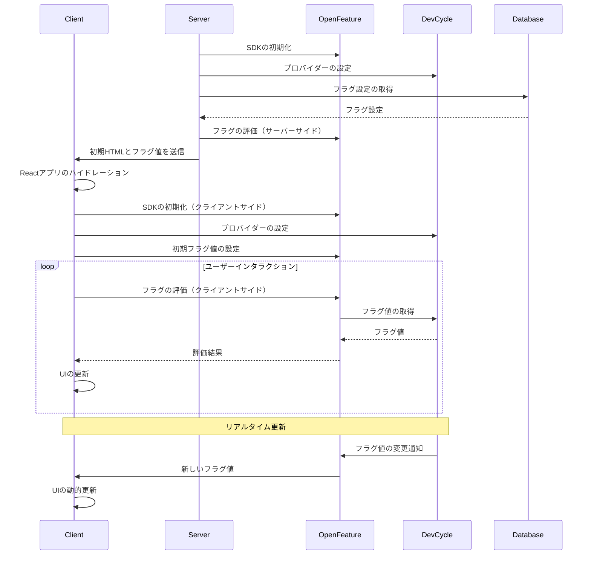

# Design Doc: OpenFeature + DevCycle Integration for Remix Application

## 1. 概要

このデザインドキュメントでは、RemixアプリケーションにOpenFeatureを使用してDevCycleのフラグ管理を実装する方法について詳細に説明します。RemixのServer-Side Rendering (SSR)とClient-Side Rendering (CSR)の特性を考慮し、サーバーサイドとクライアントサイドでのシームレスな統合を目指します。

### 1.1 背景

フィーチャーフラグは、新機能のロールアウト、A/Bテスト、カナリアリリースなどを効率的に管理するために重要です。OpenFeatureは、フィーチャーフラグの標準化を目指すオープンソースプロジェクトであり、DevCycleはこの標準に準拠したフラグ管理サービスです。

### 1.2 スコープ

1. RemixアプリケーションでOpenFeatureとDevCycleを統合し、効率的なフラグ管理を実現する
2. サーバーサイドとクライアントサイドの両方でフラグ評価を可能にする
3. パフォーマンスとユーザーエクスペリエンスを最適化する

### 1.3 スコープ外

1. DevCycle以外のフラグ管理サービスとの統合
2. フラグ管理のUI実装（DevCycleのダッシュボードを使用）

## 2. アーキテクチャ概要

RemixアプリケーションのSSRとCSRの特性を考慮し、以下のようなアーキテクチャを提案します：

1. サーバーサイド：OpenFeature Node.js SDKとDevCycle Node.js SDKを使用
2. クライアントサイド：OpenFeature React SDKとDevCycle Web SDKを使用
3. Remix loaderでの初期フラグ評価
4. クライアントサイドでのフラグ再評価と動的更新




### 2.1. 設計意図

#### 2.1.1 サーバーサイドの初期化:


```ts
// app/lib/featureFlags/server.ts
export const initializeServerFeatureFlags = async () => {
  const devcycleClient = initializeDevCycle(env.DEVCYCLE_SERVER_SDK_KEY);
  await OpenFeature.setProviderAndWait(await devcycleClient.getOpenFeatureProvider());
  return OpenFeature.getClient();
};

export const openFeatureClient = await initializeServerFeatureFlags();
```


サーバーサイドでの初期化は、アプリケーションの起動時に一度だけ行われます。これにより、サーバーサイドのローダー関数内でフラグ評価を行うことができます。

#### 2.1.2 クライアントサイドの初期化:


```tsx
// app/root.tsx
  useEffect(() => {
    const provider = new DevCycleProvider(ENV.DEVCYCLE_SDK_KEY_CLIENT);
    OpenFeature.setProvider(provider);

    // ユーザー情報をコンテキストとして設定
    OpenFeature.setContext({
      targetingKey: user.uid,
      email: user.email,
    });
  }, [ENV.DEVCYCLE_SDK_KEY_CLIENT, user]);
```


クライアントサイドでの初期化は、アプリケーションがブラウザで読み込まれた後に行われます。これにより、クライアントサイドのコンポーネント内でフラグ評価を行うことができます。

### 2.2. 設計の意図と仕組み:

1. サーバーサイドレンダリング (SSR) のサポート:
   - Remixはサーバーサイドレンダリングを行うため、初期ページロード時にサーバーサイドでフラグ評価を行う必要があります。
   - これにより、初期HTMLにフラグの状態を反映させることができ、パフォーマンスとSEOが向上します。

2. クライアントサイドでの動的更新:
   - ブラウザでアプリケーションが動作している間、ユーザーのコンテキストや条件が変更される可能性があります。
   - クライアントサイドの初期化により、これらの変更に応じてリアルタイムでフラグを再評価できます。

3. 一貫性の確保:
   - サーバーサイドとクライアントサイドで同じOpenFeatureプロバイダーを使用することで、フラグ評価の一貫性を確保します。
   - これにより、サーバーサイドとクライアントサイドで異なる結果が返されるリスクを軽減します。

4. コンテキストの管理:
   - サーバーサイドでは、リクエストごとに異なるユーザーコンテキストを持つ可能性があります。
   - クライアントサイドでは、アプリケーションのライフサイクル中にユーザーコンテキストが変更される可能性があります。
   - 両方で初期化することで、それぞれの環境に適したコンテキスト管理が可能になります。

5. パフォーマンスの最適化:
   - サーバーサイドでの初期評価により、初期ページロードのパフォーマンスが向上します。
   - クライアントサイドでの再初期化により、その後のインタラクションでのパフォーマンスが最適化されます。


## 3. 詳細設計

### 3.1 サーバーサイド実装

#### 3.1.1 OpenFeatureプロバイダーの設定

以下が公式仕様です：
- OpenFeature Node.js SDKは`@openfeature/server-sdk`パッケージを使用します。
- DevCycle Node.js SDKは`@devcycle/nodejs-server-sdk`パッケージを使用します。
- OpenFeatureプロバイダーの設定には`OpenFeature.setProviderAndWait()`メソッドを使用します。

参照：
- [OpenFeature Node.js SDK](https://openfeature.dev/docs/reference/technologies/server/javascript/)
- [DevCycle Node.js SDK](https://docs.devcycle.com/sdk/server-side-sdks/node/node-openfeature)

だから、以下のように設計します：

```typescript
// app/lib/featureFlags/server.ts
import { OpenFeature } from '@openfeature/server-sdk'
import { initializeDevCycle } from '@devcycle/nodejs-server-sdk'

const devcycleClient = initializeDevCycle(process.env.DEVCYCLE_SERVER_SDK_KEY)
await OpenFeature.setProviderAndWait(await devcycleClient.getOpenFeatureProvider())

export const openFeatureClient = OpenFeature.getClient()
```

この設計により、サーバーサイドでOpenFeatureクライアントを初期化し、DevCycleプロバイダーを設定します。


### 3.1.2 フラグ評価の実装

フラグ評価は、OpenFeatureクライアントを使用して直接行います。これにより、新しいvariantを追加する際にメソッドを追加する必要がなくなり、柔軟性が向上します。

以下が公式仕様です：
- OpenFeature Node.js SDKの`getClient()`メソッドを使用してクライアントを取得します。
- クライアントの`getBooleanValue()`, `getStringValue()`, `getNumberValue()`, `getObjectValue()`メソッドを使用して各型のフラグ値を取得します。

参照：
- [OpenFeature Node.js SDK - Evaluation API](https://openfeature.dev/docs/reference/technologies/server/javascript#evaluation-api)

だから、以下のように設計します：

```typescript
// app/lib/featureFlags/server.ts
import { OpenFeature } from '@openfeature/server-sdk'

// OpenFeatureクライアントをエクスポート
export const openFeatureClient = OpenFeature.getClient()
```

この設計により、アプリケーション内の必要な場所で直接OpenFeatureクライアントのメソッドを呼び出してフラグを評価できます。例えば：

```typescript
// app/routes/some-route.tsx
import { openFeatureClient } from '~/lib/featureFlags/server'

export const loader = async ({ request }) => {
  const user = await getUser(request)
  const context = { targetingKey: user.id }

  const featureEnabled = await openFeatureClient.getBooleanValue('my-feature', false, context)
  const variantName = await openFeatureClient.getStringValue('experiment', 'control', context)

  // ローダーの残りの部分...
}
```


### 3.2 クライアントサイド実装

#### 3.2.1 OpenFeatureプロバイダーの設定

以下が公式仕様です：
- OpenFeature React SDKは`@openfeature/react-sdk`パッケージを使用します。
- DevCycle Web SDKは`@devcycle/openfeature-web-provider`パッケージを使用します。
- `OpenFeature`で`setContext`でコンテキストを設定します。
- `OpenFeatureProvider`コンポーネントを使用してプロバイダーを設定します。

参照：
- [OpenFeature React SDK](https://openfeature.dev/docs/reference/technologies/client/web/react)
- [DevCycle React SDK](https://docs.devcycle.com/sdk/client-side-sdks/react/react-openfeature)

だから、以下のように設計します：

```tsx
// app/root.tsx
import { OpenFeatureProvider } from '@openfeature/react-sdk'
import DevCycleProvider from '@devcycle/openfeature-web-provider'
import { OpenFeature } from '@openfeature/web-sdk'
...

export const loader = async ({ request }: LoaderFunctionArgs) => {
  ...

  return defer({
    ...
    user,
    ENV: {
      DEVCYCLE_CLIENT_SDK_KEY: process.env.DEVCYCLE_CLIENT_SDK_KEY,
    },
  })
}
...
export default function App() {
  const { user, ENV } = useLoaderData<typeof loader>()

  useEffect(() => {
    // ユーザー情報をコンテキストとして設定
    OpenFeature.setContext({
      user_id: user.tenantId,
      email: user.email,
    })
  }, [ENV.DEVCYCLE_SDK_KEY_CLIENT, user])

  return (
    <OpenFeatureProvider>
      {/* アプリケーションの残りの部分 */}
    </OpenFeatureProvider>
  )
}
```

この設計により、クライアントサイドでOpenFeatureプロバイダーを設定し、アプリケーション全体でフラグ評価を可能にします。

#### 3.2.2 React用フックの利用

以下が公式仕様です：
- OpenFeature React SDKは`useBooleanFlag`、`useStringFlag`などのフックを提供します。
- これらのフックは、フラグ名とデフォルト値を引数に取ります。

参照：
- [OpenFeature React Hooks](https://openfeature.dev/docs/reference/technologies/client/web/react#hooks)

だから、以下のように設計します：

```tsx
// app/routes/some-route.tsx
import React from 'react';
import { useBooleanFlag, useStringFlag } from '@openfeature/react-sdk';

export const FeatureFlagExample: React.FC = () => {
  // ブール型のフラグを取得
  const { value: isNewFeatureEnabled } = useBooleanFlag('new-feature', false);

  // 文字列型のフラグを取得
  const { value: buttonColor } = useStringFlag('button-color', 'blue');

  return (
    <div>
      <h2>フィーチャーフラグの例</h2>
      {isNewFeatureEnabled ? (
        <p>新機能が有効です！</p>
      ) : (
        <p>新機能は現在無効です。</p>
      )}
      <button style={{ backgroundColor: buttonColor }}>
        色が変わるボタン
      </button>
    </div>
  );
};
```

この設計により、コンポーネント内で簡単にフラグを評価できるカスタムフックを提供します。


## 4. パフォーマンスとセキュリティ

### 4.1 パフォーマンス最適化

1. サーバーサイドでの初期フラグ評価によるFirst Contentful Paint (FCP)の改善
2. `defer()`を使用した非ブロッキングデータローディング
3. クライアントサイドでのフラグ再評価の最小化

### 4.2 セキュリティ考慮事項

1. 環境変数を使用したSDKキーの管理
2. センシティブな情報をフラグコンテキストに含めない
3. HTTPS通信の強制

## 5. テストと検証

1. サーバーサイドフラグ評価関数の単体テスト
2. クライアントサイドフックの単体テスト
3. Remixローダーとコンポーネントの統合テスト
4. エンドツーエンドテスト

## 6. デプロイメントと運用

1. 環境変数の設定（`DEVCYCLE_SERVER_SDK_KEY`、`DEVCYCLE_CLIENT_SDK_KEY`）
2. フラグ評価のパフォーマンスモニタリング
3. フラグ使用状況の分析

## 7. 今後の拡張性

1. A/Bテスト機能の統合
2. カスタムイベントトラッキングの実装
3. マルチバリアントフラグのサポート

## 8. 結論

この設計により、RemixアプリケーションでOpenFeatureとDevCycleを効果的に統合し、サーバーサイドとクライアントサイドの両方でフラグ管理を実現できます。パフォーマンスとユーザーエクスペリエンスを最適化しつつ、将来の拡張性も考慮しています。

## 9. 参考文献

- [OpenFeature Specification](https://openfeature.dev/specification/sections/providers)
- [DevCycle Documentation](https://docs.devcycle.com/)
- [Remix Documentation](https://remix.run/docs/en/main)
